# CFn example - CodePipeline to execute CFn
Minimum example of CodePipeline which executes CloudFormation.

## Patterns
There are two patterns to execute CloudFormation with CodePipeline.

1. Native CloudFormation Action Pattern
2. CodeBuild Action Pattern

## 1️⃣ Native CloudFormation Action Pattern
This pattern uses CodePipeline's native CloudFormation Action.

### Architecture



### Code Structure
native-cfn-action-pattern
├── Makefile
├── cfn-execution-pipeline-native-cfn-action-pattern.yaml
└── config
    └── dev.json

### Deploy
Edit [native-cfn-action-pattern/config/dev.json](./native-cfn-action-pattern/config/dev.json).

```
{
    "Parameters": {
        "CodeCommitName": "YOUR_CODECOMMIT_NAME_HERE",
        "CfnStackName": "YOUR_CFN_STACK_NAME_HERE",
        "CfnTemplatePath": "YOUR_CFN_TEMPLATE_PATH_HERE",
        "CfnConfigFilePath": "YOUR_CONFIG_FILE_PATH_HERE"
    }
}
```

Then execute make command.

```
$ cd native-cfn-action-pattern
$ make deploy-with-local
```

NOTE: This example uses [rain](https://github.com/aws-cloudformation/rain) as deploy tool.

## 2️⃣ CodeBuild Action Pattern
This pattern uses CodeBuild Action. You have to use aws cli's cloudformattion command as well.

> 🚧: UNDER CONSTRUCTION - Somewhat 'aws cloudformation deploy' returns error only on CodeBuild.

### Architecture



### Code Structure
```
codebuild-action-pattern
├── Makefile
├── cfn-execution-pipeline-codebuild-action-pattern.yaml
└── config
    └── dev.json
```

### Deploy
Edit [codebuild-action-pattern/config/dev.json](./codebuild-action-pattern/config/dev.json).

```
{
    "Parameters": {
        "CodeCommitName": "YOUR_CODECOMMIT_NAME_HERE",
        "CfnStackName": "YOUR_CFN_STACK_NAME_HERE",
        "CfnTemplatePath": "YOUR_CFN_TEMPLATE_PATH_HERE",
        "CfnConfigFilePath": "YOUR_CONFIG_FILE_PATH_HERE"
    }
}
```

Then execute make command.

```
$ cd codebuild-action-pattern
$ make deploy-with-local
```

NOTE: This example uses [rain](https://github.com/aws-cloudformation/rain) as deploy tool.
